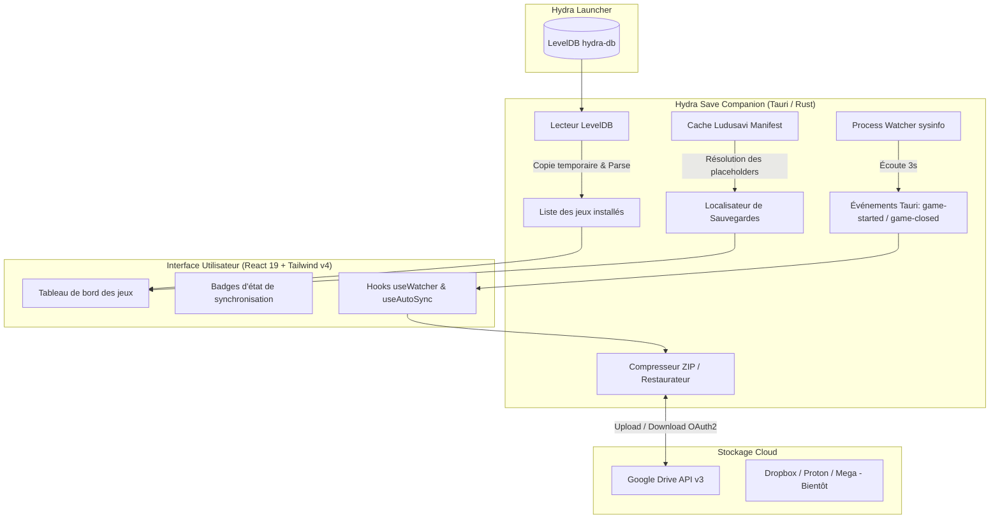

<div align="center">

# 🎮 Hydra Save Companion (HSC)

**Le compagnon de synchronisation Cloud automatique pour [Hydra Launcher](https://github.com/hydralauncher/hydra).**

Sauvegardez, synchronisez et restaurez automatiquement les sauvegardes de vos jeux PC sur le Cloud sans configuration fastidieuse.

[](https://tauri.app/)
[](https://www.rust-lang.org/)
[](https://react.dev/)
[](https://www.typescriptlang.org/)
[](https://tailwindcss.com/)
[](LICENSE)

[Fonctionnalités](#-fonctionnalités-clés) • [Architecture](#-architecture--fonctionnement) • [Installation](#-installation--démarrage) • [Configuration](#-variables-denvironnement) • [Roadmap](#-roadmap)

---

</div>

## 💡 Pourquoi Hydra Save Companion ?

**[Hydra Launcher](https://github.com/hydralauncher/hydra)** est un lanceur de jeux vidéo open-source puissant. Cependant, les jeux installés indépendamment des plateformes officielles (Steam, Epic, GOG) ne bénéficient pas de la synchronisation des sauvegardes dans le Cloud (**Steam Cloud**). En cas de changement de machine, de réinstallation de Windows ou pour alterner entre un PC fixe et un PC portable / ROG Ally / Steam Deck, vos sauvegardes sont souvent perdues ou difficiles à transférer.

**Hydra Save Companion (HSC)** comble ce manque :
- Il lit en direct la bibliothèque de vos jeux installés dans **Hydra Launcher**.
- Il identifie automatiquement l'emplacement exact de chaque sauvegarde grâce à l'immense base communautaire **Ludusavi**.
- Il surveille l'exécution de vos jeux en arrière-plan et **téléverse vos sauvegardes sur le Cloud dès que vous quittez une partie**.
- Il **télécharge et met à jour automatiquement vos fichiers de sauvegarde** lorsque des versions plus récentes existent sur votre Cloud.

---

## ✨ Fonctionnalités Clés

### 🔄 Synchronisation Cloud Transparente
- **Upload automatique à la fermeture** : Détecte l'arrêt du processus de jeu et attend un court délai de sécurité (cooldown de 45 secondes) pour s'assurer que les fichiers ont fini d'être écrits sur le disque avant de créer l'archive `.zip` et de l'envoyer.
- **Vérification & Téléchargement périodique** : Vérifie à intervalle régulier (5 min, 15 min, 30 min ou manuel) si une sauvegarde plus récente est disponible sur le Cloud et l'applique automatiquement.
- **Conservation des horodatages précis** : Les dates de modification des sauvegardes locales et distantes sont normalisées en UTC et synchronisées à la seconde près.

### 🧠 Détection Intelligente des Sauvegardes
- **Intégration du manifeste Ludusavi** : Téléchargement et mise en cache du manifeste officiel [Ludusavi](https://github.com/mtkennerly/ludusavi-manifest) répertoriant les chemins de sauvegarde de plus de 10 000 jeux PC.
- **Résolution des chemins dynamiques** : Prise en charge des variables d'environnement (`%APPDATA%`, `%LOCALAPPDATA%`, `Saved Games`, `Documents`, répertoires sous Linux `$HOME`, etc.) et des identifiants Steam (`SteamID` via registre Windows).
- **Support des émulateurs de DRM** : Heuristiques spécifiques pour localiser les sauvegardes créées par les émulateurs courants (RUNE, CODEX, TENOKE, EMPRESS, Goldberg SteamEmu, FLT, Razor1911...).

### 🎮 Intégration Native Hydra Launcher
- **Accès direct LevelDB** : Lecture sécurisée de la base de données LevelDB locale d'Hydra Launcher (`hydra-db`) via une copie temporaire pour éviter tout verrouillage d'écriture.
- **Filtrage intelligent** : Seuls les jeux actuellement installés, actifs et dotés d'un exécutable valide sont affichés (exclusion des imports Steam officiels qui possèdent déjà leur propre Cloud).

### 🖼️ Interface Soignée & Visuels Riches
- **Jaquettes officielles Steam** : Récupération dynamique des bannières et jaquettes de jeux via l'API Steam Store et le CDN Cloudflare Steam.
- **Badges de statut en direct** : Visualisation instantanée de l'état de chaque jeu :
  - 🟢 **À jour** : Fichiers locaux et distants parfaitement synchronisés.
  - 🔵 **Local plus récent** : Sauvegarde prête à être envoyée vers le Cloud.
  - 🟡 **Cloud plus récent** : Nouvelle sauvegarde disponible sur le Cloud.
  - 📥 **À télécharger** : Sauvegarde disponible dans le Cloud pour une nouvelle installation.
  - ⚠️ **Jamais synchronisé** ou **Sauvegarde introuvable**.
- **Accès rapide en un clic** : Ouverture directe du dossier local de sauvegarde dans l'explorateur de fichiers.
- **Système de signalement intégré** : Possibilité de signaler directement un problème d'emplacement de sauvegarde pour un jeu.

### ⚡ Léger, Discret et Performant
- Construit avec **Tauri v2** et **Rust** pour une empreinte mémoire minimale (< 50 Mo de RAM).
- **System Tray (Zone de notification)** : Réduction dans la barre des tâches sans perturber vos sessions de jeu.
- **Notifications système natives** lors du démarrage, de la fermeture d'un jeu et de la fin de synchronisation.

---

## 📐 Architecture & Fonctionnement



---

## 🛠️ Stack Technique

### Frontend
- **Framework** : [React 19](https://react.dev/) + [TypeScript](https://www.typescriptlang.org/)
- **Build tool** : [Vite](https://vitejs.dev/)
- **Styles** : [Tailwind CSS v4](https://tailwindcss.com/)
- **Gestion d'état & Cache** : [@tanstack/react-query v5](https://tanstack.com/query/latest)
- **Icônes** : [Lucide React](https://lucide.dev/)

### Backend (Tauri v2 / Rust)
- **Runtime** : [Tauri v2](https://tauri.app/)
- **Accès base de données** : [`rusty-leveldb`](https://crates.io/crates/rusty-leveldb)
- **Surveillance système** : [`sysinfo`](https://crates.io/crates/sysinfo)
- **Réseau & Requêtes** : [`reqwest`](https://crates.io/crates/reqwest) (asynchrone avec `tokio`)
- **Archives & Fichiers** : [`zip`](https://crates.io/crates/zip), [`walkdir`](https://crates.io/crates/walkdir)
- **Formats de données** : [`serde`](https://crates.io/crates/serde), [`serde_json`](https://crates.io/crates/serde_json), [`serde_yaml`](https://crates.io/crates/serde_yaml)
- **Authentification** : [`tauri-plugin-oauth`](https://github.com/tauri-apps/tauri-plugin-oauth)
- **Plugins Tauri** : `notification`, `store`, `opener`

---

## 🚀 Installation & Démarrage

### Prérequis
1. **Node.js** (v20 ou supérieur recommandé) et **pnpm** (ou npm / yarn).
2. **Rust** et Cargo (installation via [rustup.rs](https://rustup.rs/)).
3. Dépendances système Tauri selon votre OS (voir le [Guide officiel Tauri](https://tauri.app/start/prerequisites/)).
4. **Hydra Launcher** installé sur votre machine avec au moins un jeu configuré.

### 1. Cloner le projet
```bash
git clone https://github.com/nathanlgn62/hydra-save-companion.git
cd hydra-save-companion
```

### 2. Installer les dépendances
```bash
pnpm install
```

### 3. Configurer l'authentification Cloud
Le projet utilise OAuth2 pour se connecter aux services Cloud. Pour Google Drive, vous devez créer des identifiants dans la [Google Cloud Console](https://console.cloud.google.com/) (Application de type Desktop / Bureau avec redirection sur `http://localhost:8000`).

Exportez vos clés dans votre environnement ou créez un fichier `.env` :
```bash
export HSC_GC_ID="votre_google_client_id.apps.googleusercontent.com"
export HSC_GS="votre_google_client_secret"
```
*(Le projet intègre également le support d'[Infisical](https://infisical.com/) via `infisical run --env=dev -- tauri dev`)*.

### 4. Lancer en mode développement
```bash
pnpm tauri dev
```
*(Ou avec pnpm directement si vos variables sont chargées)* :
```bash
pnpm dev
# Dans un second terminal pour Tauri :
pnpm tauri dev
```

### 5. Compiler l'application pour la production
```bash
pnpm tauri build
```
L'exécutable et l'installeur (MSI / EXE pour Windows, DEB / AppImage pour Linux) seront générés dans le dossier `src-tauri/target/release/bundle/`.

---

## ⚙️ Variables d'Environnement

| Variable | Description | Requis |
| :--- | :--- | :---: |
| `HSC_GC_ID` | Client ID Google Cloud OAuth 2.0 | **Oui** (pour Google Drive) |
| `HSC_GS` | Client Secret Google Cloud OAuth 2.0 | **Oui** (pour Google Drive) |
| `HSC_DBX_ID` | App Key Dropbox API | Optionnel |
| `HSC_DBX_SECRET` | App Secret Dropbox API | Optionnel |
| `HSC_PROTON_ID` | Client ID Proton API | Optionnel |
| `HSC_PROTON_SECRET` | Client Secret Proton API | Optionnel |

---

## 📁 Emplacements des données

| Donnée | Emplacement |
| :--- | :--- |
| **Paramètres utilisateur** | `settings.json` (via `@tauri-apps/plugin-store`) |
| **Base Hydra Launcher (Windows)** | `%APPDATA%\hydralauncher\hydra-db` |
| **Base Hydra Launcher (Linux)** | `~/.config/hydralauncher/hydra-db` ou `~/.local/share/hydralauncher/hydra-db` |
| **Cache Manifeste Ludusavi** | Dossier temporaire système (`temp_dir()/hydra_companion/ludusavi_manifest.yaml`) |

---

## 🗺️ Roadmap

- [x] Détection automatique des jeux installés via LevelDB Hydra.
- [x] Intégration du catalogue communautaire Ludusavi YAML.
- [x] Récupération automatique des jaquettes Steam.
- [x] Watcher de processus en temps réel (`sysinfo`).
- [x] Synchronisation avec Google Drive (OAuth2 + dossier dédié).
- [x] Téléversement automatique différé (cooldown à la fermeture du jeu).
- [x] Téléchargement périodique programmable (5/15/30 min).
- [x] Tray Icon et notifications système de bureau.
- [ ] Support complet de fournisseurs Cloud supplémentaires :
  - [ ] Dropbox
  - [ ] Proton Drive
  - [ ] Mega / WebDAV / Serveur auto-hébergé (Nextcloud)
- [ ] Édition manuelle du chemin de sauvegarde personnalisé par jeu.
- [ ] Gestionnaire de versions de sauvegardes (historique des points de restauration).
- [ ] Système de détection et résolution visuelle de conflits de sauvegarde.

---

## 🤝 Contribution & Remerciements

Les contributions, suggestions et signalements de bugs sont les bienvenus ! N'hésitez pas à ouvrir une Issue ou à soumettre une Pull Request.

Un grand merci aux projets open-source qui rendent cette application possible :
- **[Hydra Launcher](https://github.com/hydralauncher/hydra)** pour l'incroyable lanceur de jeux.
- **[Ludusavi](https://github.com/mtkennerly/ludusavi)** et sa communauté pour leur travail colossal sur le répertoire de sauvegardes de jeux vidéo.
- **[Tauri](https://tauri.app/)** pour ce framework desktop ultra-léger et moderne.

---

## 📝 Licence

Ce projet est distribué sous la licence **MIT**. Consultez le fichier `LICENSE` pour plus d'informations.
